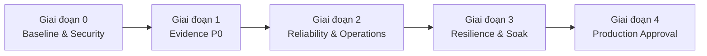

# KẾ HOẠCH TRIỂN KHAI CHI TIẾT LOCAL AI STACK (NVIDIA GB10)

> Tài liệu thực thi dựa trên `Tai_Lieu_Trien_Khai_Local_AI.md`
>
> Cập nhật: **2026-09-04**
>
> Mục tiêu: đưa hệ thống từ `đang chạy thử nghiệm` sang `production ready`
>
> Trạng thái: **P0 còn mở; chưa được phép chạy production gate**
>
> Owner tổng thể: **TBD** | Security owner: **TBD** | Data owner: **TBD** |
> Operations owner: **TBD**

## 1. Cách theo dõi kế hoạch

Trạng thái của từng đầu mục phải dùng đúng quy ước trong runbook:

| Trạng thái | Cách dùng |
| --- | --- |
| `target` | Mục tiêu chưa triển khai |
| `configured` | Đã có trong file cấu hình nhưng chưa đủ bằng chứng runtime |
| `verified` | Đã chạy test đúng tiêu chí và lưu artifact |
| `blocked` | Thiếu điều kiện bắt buộc để đi tiếp |

Một đầu mục chỉ được đánh dấu `[x]` khi đáp ứng toàn bộ Definition of Done:

1. Có owner, ngày thực hiện và change/test ID.
2. Cấu hình đã redact, image digest và model revision được ghi lại.
3. Test chạy đúng tầng cần chứng minh; không thay thế test end-to-end bằng healthcheck.
4. Test fail khi lệnh lỗi, parser lỗi hoặc thiếu artifact.
5. Raw output, log và báo cáo được lưu tại `evidence/<test-id>/`, không chứa secret.
6. Có rollback hoặc recovery procedure đã được kiểm tra nếu thay đổi dữ liệu/runtime.
7. Runbook, Compose và kế hoạch này không mâu thuẫn sau khi hoàn tất.

## 2. Baseline đã xác minh

| Hạng mục | Trạng thái | Kết quả ngày 2026-09-04 |
| --- | --- | --- |
| Compose syntax | `verified` | `docker compose config --quiet` pass |
| Service health | `verified` | Bảy container đang `healthy` |
| Nginx syntax | `verified` | `nginx -t` pass |
| Backend binding | `configured` | Backend bind loopback; chưa có external LAN/IPv6 scan artifact |
| Secret file | `configured` | `.env` quyền `0600` và được Git ignore |
| Qdrant authentication | `configured` | API key đã khai báo; chưa có negative-auth test |
| Model alias | `configured` | Compose chỉ còn `qwen2.5-14b`; chưa lưu `/v1/models` |
| Immutable versions | `blocked` | Còn `latest`, `main` và model revision chưa pin |
| Langfuse tracing | `blocked` | Health pass nhưng chưa có trace end-to-end |
| RAG isolation | `blocked` | Test hiện tại gọi Qdrant trực tiếp, không test user/group thật |
| Backup/restore | `blocked` | Sai Open WebUI volume; restore chưa chạy trên môi trường sạch |
| Performance SLO | `blocked` | Harness dùng sai percentile/ngưỡng và không fail-closed |

## 3. Thứ tự triển khai

Không bắt đầu soak test hoặc production approval khi bất kỳ đầu mục P0 nào còn mở.

## 4. Giai đoạn 0 - Baseline, bí mật và tính lặp lại (P0)

### 4.1. Quản trị bằng chứng

- [ ] **EVD-01:** Tạo cấu trúc `evidence/<test-id>/` và mẫu manifest gồm timestamp,
  owner, host, OS/driver, Compose commit, image digest, model revision, command,
  exit code và kết luận.
- [ ] **EVD-02:** Sửa mọi test để trả exit code khác 0 khi command/parser/check
  thất bại hoặc khi thiếu artifact bắt buộc.
- [ ] **EVD-03:** Gắn mỗi checkbox trong tài liệu này với đường dẫn artifact; đặt
  thời hạn hết hiệu lực cho benchmark, restore drill, port scan và security test.
- [ ] **EVD-04:** Chỉ định owner và approver cho security, data, operations và AI
  quality; điền target date cho từng phase.

Điều kiện qua phase: mẫu evidence được review và một smoke test mẫu có thể tái lập.

### 4.2. Secrets và dữ liệu backup

- [ ] **SEC-01:** Xóa Qdrant API key fallback hard-code khỏi
  `scripts/rag_leakage_test.py`; thiếu biến môi trường phải làm test fail.
- [ ] **SEC-02:** Scan working tree và Git history; lập danh sách secret từng xuất
  hiện, rotate chúng và chỉ lưu ID/ngày rotation, không lưu giá trị.
- [ ] **SEC-03:** Tách secret khỏi backup dữ liệu; nếu cần backup secret, dùng kho
  mã hóa riêng với access policy và recovery-key procedure.
- [ ] **SEC-04:** Đặt backup directory/file về quyền tối thiểu, mã hóa at rest và
  sao chép ít nhất một bản sang thiết bị/host độc lập.
- [ ] **SEC-05:** Viết lịch rotation, owner, expiry và thủ tục thu hồi cho từng secret.

Điều kiện qua phase: không còn credential trong file tracked/log; secret cũ đã
rotate; restore vẫn thực hiện được bằng secret được cấp qua quy trình chuẩn.

### 4.3. Pin image và model

- [ ] **REL-01:** Thay mọi moving tag (`latest`, `main`, tag major/variant có thể
  trôi) bằng version đã kiểm thử và digest.
- [ ] **REL-02:** Pin model Hugging Face bằng revision/commit bất biến; ghi rõ
  checkpoint format, tokenizer và chat template.
- [ ] **REL-03:** Xác minh cold start không phụ thuộc moving revision; lưu log model
  root/revision và output `/v1/models`.
- [ ] **REL-04:** Thử upgrade và rollback image/model trên staging hoặc Compose
  project riêng; xác định abort threshold trước khi đổi production.

Điều kiện qua phase: cùng manifest khởi động lặp lại được và rollback pass.

### 4.4. Network exposure

- [ ] **NET-01:** Quét từ một máy khác trên LAN/VPN qua IPv4 và IPv6; xác nhận chỉ
  cổng 80/443 của gateway được phép truy cập.
- [ ] **NET-02:** Kiểm tra firewall host và Docker published ports; xác minh SSH chỉ
  cho admin subnet/VPN.
- [ ] **NET-03:** Test Qdrant với API key thiếu, sai và đúng; hai trường hợp đầu phải
  bị từ chối và không lộ metadata.
- [ ] **NET-04:** Lưu sơ đồ trust boundary, nguồn được phép, port và owner phê duyệt.

Điều kiện qua phase: external scan và negative-auth test pass, có raw output.

## 5. Giai đoạn 1 - Bằng chứng chức năng P0

### 5.1. Tracing end-to-end

- [ ] **OBS-01:** Chọn đường instrumentation được hỗ trợ: Open WebUI middleware,
  SDK hoặc OpenTelemetry/proxy.
- [ ] **OBS-02:** Cấp credential riêng, giới hạn quyền và cấu hình endpoint Langfuse.
- [ ] **OBS-03:** Gửi một request thành công và một request lỗi; xác minh trace có
  user/session, model, token usage, TTFT/latency, status và error đúng.
- [ ] **OBS-04:** Test hành vi khi Langfuse/queue mất; inference đi theo policy đã
  phê duyệt và alert được kích hoạt.
- [ ] **OBS-05:** Lập kế hoạch migration Langfuse v2, gồm backup, staging, data
  validation và rollback.

Điều kiện qua phase: trace có thể đối chiếu từ gateway request ID tới Langfuse;
healthcheck đơn thuần không được tính.

### 5.2. RAG authorization và data governance

- [ ] **GOV-01:** Định nghĩa owner, group đọc/ghi, retention và delete policy cho
  từng knowledge base; mặc định deny khi thiếu tenant/group.
- [ ] **GOV-02:** Tạo ít nhất hai user và hai group thật trong Open WebUI, cùng bộ
  tài liệu adversarial có marker bí mật riêng.
- [ ] **GOV-03:** Viết lại test để chạy qua API/application path thật, bao phủ upload,
  list, retrieve, chat generation, delete và user bị thu hồi quyền.
- [ ] **GOV-04:** Test bỏ/sửa tenant filter, truy cập ID trực tiếp, prompt injection
  trong tài liệu và truy vấn semantic gần giống dữ liệu tenant khác.
- [ ] **GOV-05:** Xác minh audit log ghi allow/deny mà không chứa nội dung hoặc
  credential nhạy cảm.
- [ ] **RAG-01:** Ghi embedding model và dimension thực; backup rồi chạy
  upload-reindex-retrieve-delete, bao gồm kiểm tra dữ liệu cũ không bị orphan.

Điều kiện qua phase: không có cross-tenant leak trong toàn bộ test matrix và mọi
deny path có audit.

### 5.3. Backup và disaster recovery

- [ ] **DR-01:** Quyết định RPO và RTO theo nhu cầu nghiệp vụ, gồm phạm vi outage
  một service, hỏng dữ liệu và mất toàn host.
- [ ] **DR-02:** Sửa backup Open WebUI để resolve volume qua
  `docker compose`/`docker volume inspect` thay vì tên `open-webui-data` cố định.
- [ ] **DR-03:** Dùng cơ chế backup nhất quán cho SQLite/uploads, PostgreSQL, Qdrant
  và các datastore Langfuse; không tar database đang ghi mà không quiesce/snapshot.
- [ ] **DR-04:** Parse JSON bằng parser cấu trúc; tạo manifest đầy đủ, complete
  marker và checksum. Backup thiếu thành phần phải fail và không được chọn restore.
- [ ] **DR-05:** Sửa restore Qdrant cho collection có dấu gạch dưới; định nghĩa rõ
  dùng full snapshot hay collection snapshot và test cả hai nếu đều được giữ.
- [ ] **DR-06:** Restore vào Compose project/volume sạch, tuyệt đối không mặc định
  ghi đè runtime đang hoạt động.
- [ ] **DR-07:** Sau restore, đối chiếu record count, user/chat/file, collection,
  sample retrieval và trace; chạy smoke test ứng dụng.
- [ ] **DR-08:** Đo RPO/RTO end-to-end từ lúc bắt đầu recovery đến khi service sẵn
  sàng cho người dùng; lưu log và kết quả off-host restore drill.

Điều kiện qua phase: clean-room restore đạt RPO/RTO và dữ liệu được xác minh ở
tầng ứng dụng, không chỉ checksum file.

### 5.4. Benchmark và capacity

- [ ] **PERF-01:** Kiểm tra exit code của `vllm bench serve`; parser thiếu bất kỳ
  metric bắt buộc nào phải làm job fail.
- [ ] **PERF-02:** Đo đúng TTFT/ITL/E2E/queue p50, p95, p99, error rate, achieved
  request rate, token goodput, preemption và peak memory.
- [ ] **PERF-03:** Dùng ít nhất 200 request hoặc thời lượng đủ dài sau warm-up cho
  mỗi profile; ghi dataset, seed và token distribution.
- [ ] **PERF-04:** Chạy rate 1/4/8/16 và client concurrency 8/16/32/64; dừng tăng
  khi SLO hoặc memory headroom fail.
- [ ] **PERF-05:** Lưu raw output cùng OS, driver, image digest, model revision,
  engine arguments, nhiệt độ/power và cache state.
- [ ] **PERF-06:** Phê duyệt capacity bằng achieved load/goodput cao nhất vẫn đạt
  đồng thời TTFT p95, ITL p95, error rate và memory headroom.

Điều kiện qua phase: báo cáo tự động không dùng mean thay percentile và không thể
PASS với metric bằng 0 do parse lỗi.

## 6. Giai đoạn 2 - Reliability, gateway và operations (P1)

### 6.1. Compose và data services

- [ ] **REL-05:** Thêm `stop_grace_period` và signal/shutdown phù hợp; test request
  đang stream khi service restart.
- [ ] **REL-06:** Test cold boot, reboot host và restart từng dependency; xác minh
  startup ordering, readiness và dữ liệu còn nguyên.
- [ ] **REL-07:** Tách network frontend/backend/data; đặt `internal: true` cho data
  network không cần egress và chỉ nối service cần thiết.
- [ ] **REL-08:** Thêm log rotation và resource limit/reservation phù hợp; xác minh
  không cản trở unified-memory profile.
- [ ] **DATA-01:** Đặt Redis `noeviction`, ACL, persistence policy và alert; không
  dùng cùng instance cho response cache/queue có eviction policy khác.
- [ ] **DATA-02:** Xác minh `vm.overcommit_memory=1` tồn tại sau reboot và Redis
  không còn warning.
- [ ] **DATA-03:** Đặt Qdrant snapshot schedule, retention, capacity alert và
  upgrade/rollback test.

### 6.2. Gateway và TLS

- [ ] **NET-05:** Đưa `nginx/nginx.conf` vào version control; giữ private key và
  certificate theo môi trường ngoài Git.
- [ ] **NET-06:** Thêm rate limit phù hợp streaming; fairness theo user/tenant phải
  được thực thi sau authentication.
- [ ] **NET-07:** Dùng certificate từ CA doanh nghiệp/public phù hợp; cấu hình SAN,
  trust distribution, renewal và expiry alert. Self-signed chỉ dùng cho lab.
- [ ] **NET-08:** Cố định canonical hostname; kiểm tra redirect/Host header, secure
  cookie, CORS, `WEBUI_URL` và `X-Forwarded-*`.
- [ ] **NET-09:** Test TLS, security headers, upload limit, WebSocket và SSE; xác
  minh rate limit trả 429 có kiểm soát.
- [ ] **NET-10:** Cập nhật Nginx connection handling để không ép
  `Connection: Upgrade` cho mọi request.

### 6.3. Monitoring và vận hành

- [ ] **OPS-01:** Thu thập gateway, vLLM, host, Open WebUI, Qdrant, Redis, Langfuse
  và backup metrics theo mục 9 của runbook.
- [ ] **OPS-02:** Tạo dashboard SLO/capacity và alert cho 5xx, latency, queue,
  memory pressure, disk/inode, persistence, snapshot age và certificate expiry.
- [ ] **OPS-03:** Gán owner/on-call, severity, notification route, runbook link và
  escalation policy cho từng alert; chạy alert drill.
- [ ] **OPS-04:** Đặt retention và delete workflow cho chat, upload, vector, trace,
  log và backup; test xóa theo user/tenant.
- [ ] **OPS-05:** Viết release/upgrade, rollback, maintenance, incident response và
  post-incident procedure.

### 6.4. AI quality và tuning

- [ ] **AI-02:** Chạy quality/eval baseline không dùng FP8 KV cache, sau đó A/B với
  profile FP8 hiện tại; calibrate scale nếu recipe yêu cầu.
- [ ] **AI-03:** Benchmark `OMP_NUM_THREADS`, `gpu-memory-utilization`,
  `max-num-seqs` và context length; chỉ thay một biến mỗi lần.
- [ ] **AI-04:** Test context budget, tool parser, tool allowlist, timeout và output
  validation; request vượt context phải lỗi rõ ràng, không cắt im lặng.
- [ ] **AI-05:** Đánh giá prefix-cache isolation/salting giữa các trust group và
  timing side-channel trước khi dùng chung cache.

Điều kiện qua phase: không còn P1 ảnh hưởng trực tiếp đến confidentiality,
integrity, availability hoặc recoverability.

## 7. Giai đoạn 3 - Resilience và soak test

### 7.1. Failure matrix

- [ ] **RES-01:** Overload trên capacity: có backpressure/429, không OOM và tự hồi phục.
- [ ] **RES-02:** Prompt vượt context: trả lỗi dự kiến, không 500 hoặc cắt im lặng.
- [ ] **RES-03:** Client ngắt stream: generation được hủy và slot giải phóng đúng hạn.
- [ ] **RES-04:** Dừng Qdrant/Redis/PostgreSQL/Langfuse từng service: luồng nhạy
  cảm fail closed, health và alert hoạt động.
- [ ] **RES-05:** Restart host: service lên đúng thứ tự, dữ liệu và pending request
  có hành vi đúng policy.
- [ ] **RES-06:** Disk/inode gần đầy và backup hỏng: alert sớm, ingestion được giới
  hạn và fallback backup hoạt động.
- [ ] **RES-07:** Certificate gần hết hạn và renewal lỗi: alert/escalation hoạt động.

### 7.2. Soak test

- [ ] **SOAK-01:** Ghi workload trước khi chạy: request mix, input/output token,
  RAG ratio, streaming, concurrency, offered rate và cache hit rate.
- [ ] **SOAK-02:** Chạy tối thiểu 24 giờ và dài hơn peak business window; không thay
  cấu hình trong thời gian đo.
- [ ] **SOAK-03:** Định nghĩa abort threshold trước test: OOM/restart, 5xx/error,
  TTFT/ITL p95, queue, memory pressure, disk growth và data leak.
- [ ] **SOAK-04:** Lưu time series, raw errors, restart count và capacity headroom;
  xác minh hệ thống trở về baseline sau peak.
- [ ] **SOAK-05:** Không chấp nhận soak PASS nếu test RAG, restore, tracing hoặc
  benchmark P0 chưa PASS với cùng manifest release.

Điều kiện qua phase: toàn bộ failure matrix và soak đạt tiêu chí, không có P0/P1
mới chưa được triage.

## 8. Giai đoạn 4 - Production approval

- [ ] **GATE-01:** Freeze release candidate bằng Git commit, Compose config đã
  redact, image digest và model revision.
- [ ] **GATE-02:** Chạy lại smoke, negative-auth, RAG ACL, tracing, benchmark ngắn,
  backup/restore drill và rollback rehearsal trên release candidate.
- [ ] **GATE-03:** Xác nhận mọi P0 đóng; P1 còn lại có risk acceptance bằng văn bản,
  owner và deadline.
- [ ] **GATE-04:** Operations, security và data owner ký phê duyệt; ghi maintenance
  window, support contact và rollback decision maker.
- [ ] **GATE-05:** Chuyển trạng thái canonical runbook sang `production`, ghi
  changelog và ngày hết hạn của evidence.
- [ ] **GATE-06:** Review sau 24 giờ và 7 ngày vận hành; đóng hoặc mở lại gate theo
  SLO, incident và capacity thực tế.

## 9. Thứ tự hành động ngay

1. Gán owner, RPO/RTO và tạo mẫu evidence.
2. Xóa credential fallback, scan/rotate secret và bảo vệ backup.
3. Pin image digest và model revision.
4. Sửa backup/restore, sau đó chạy clean-room restore.
5. Sửa benchmark và chạy lại workload chuẩn.
6. Thay RAG test bằng end-to-end user/group test.
7. Kết nối và xác minh Langfuse tracing end-to-end.
8. Hoàn thiện Redis, network, gateway, log/metric/alert và certificate.
9. Chạy failure matrix.
10. Chạy soak test và production approval.

Task `4.3`/soak test của kế hoạch cũ không còn là bước tiếp theo. Soak chỉ có ý
nghĩa sau khi các bằng chứng P0 phía trên đã được sửa và PASS trên cùng release
candidate.
