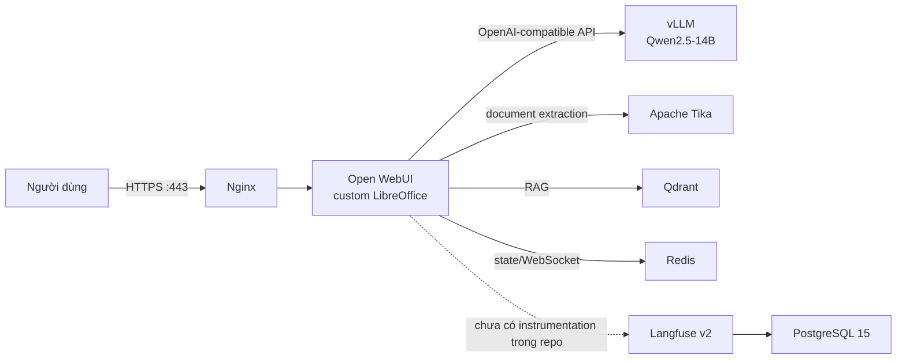
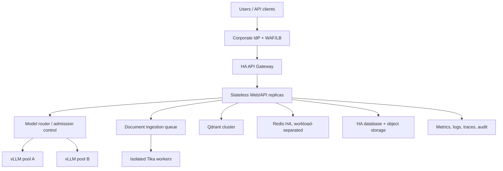

# LOCAL AI STACK TRÊN NVIDIA GB10

> Cập nhật: **2026-09-09**
>
> Phạm vi: `/home/admin/ai-stack`
>
> Trạng thái: **lab/pilot đang hoạt động; chưa đạt production readiness cho toàn công ty**

## 1. Mục tiêu và cách đọc tài liệu

Dự án cung cấp nền tảng AI nội bộ chạy tại chỗ: nhân viên chat với LLM, tải tài
liệu và truy vấn tri thức doanh nghiệp qua RAG. Runtime hiện dùng một model
Qwen2.5-14B trên NVIDIA GB10, phục vụ bởi vLLM và truy cập qua Open WebUI.

Ba tài liệu chuẩn của repository là:

- `README.md` (file này): bối cảnh, kiến trúc, hiện trạng và quyết định mở rộng.
- [`PLAN.md`](./PLAN.md): trạng thái gate, blocker, evidence và lộ trình triển khai.
- [`RUNBOOK.md`](./RUNBOOK.md): triển khai, kiểm thử, vận hành và production gate.

Tài liệu khác chỉ là artifact:

- [`docs/evidence/vllm_benchmark_2026-09-04.md`](./docs/evidence/vllm_benchmark_2026-09-04.md): kết quả benchmark lịch sử, không phải bằng chứng SLO hợp lệ.
- [`docs/archive/DESIGN-claude.md`](./docs/archive/DESIGN-claude.md): tham chiếu UI cũ, không được source code hiện tại sử dụng.

Khi thông tin mâu thuẫn, ưu tiên: runtime đã kiểm tra, Compose hiện tại, secret
manager/`.env`, ba tài liệu chuẩn, sau cùng là tài liệu nhà cung cấp đúng với
version đã pin.

## 2. Tư duy hiệu năng

LLM chạy chậm không tự động đồng nghĩa với việc phải đổi sang model nhỏ hơn.
Chuỗi cần đo và tối ưu là:

```text
Model -> Inference Engine -> GPU -> Scheduler/Batching -> KV Cache -> Network
      -> Application -> Retrieval -> Authorization -> Observability
```

Các đòn bẩy gồm quantization, KV cache, continuous batching, Flash Attention,
prefix caching, speculative decoding, inference engine, hardware, admission
control và network. Repo hiện chọn **vLLM** làm baseline; chưa có triển khai hoặc
benchmark đối chứng SGLang/TensorRT-LLM. Chỉ so engine khi giữ nguyên model
revision, hardware, workload và SLO.

## 3. Kiến trúc hiện tại



Luồng chat: người dùng đi qua Nginx, Open WebUI gọi API tương thích OpenAI của
vLLM, vLLM lập lịch request và sinh token trên GPU.

Luồng RAG dự kiến: Open WebUI nhận file, dùng LibreOffice khi cần chuyển đổi,
gọi Tika bóc tách text, tạo embedding bằng `BAAI/bge-m3`, lưu/tìm vector ở
Qdrant rồi ghép chunk vào prompt.

Langfuse/PostgreSQL đang chạy nhưng repo chưa có middleware/SDK/OTel nối request AI
vào Langfuse. Nginx đã có request ID và log redaction baseline; container Langfuse
healthy vẫn không có nghĩa là đã có tracing end-to-end.

## 4. Snapshot hiện trạng

Kiểm tra chỉ đọc ngày 2026-09-09 cho thấy `docker compose config --quiet` pass và
tám container đang chạy:

| Service | Cấu hình/runtime quan sát | Host exposure | Giới hạn hiện tại |
| --- | --- | --- | --- |
| vLLM | Runtime image digest pin; model root `Qwen/Qwen2.5-14B-Instruct`; alias `qwen2.5-14b`; FP8 weight/KV; context 16K; max 64 seq; prefix cache | `Docker internal only` | Chưa chứng minh capacity/SLO; model revision chưa được enforce bởi Compose |
| Open WebUI | Image local `open-webui-htmp:libreoffice`; không công bố package version; một replica/volume | `Docker internal only` | Chưa có bằng chứng SSO, HA hoặc ACL RAG end-to-end |
| Tika | Image digest pin; task timeout 15 phút; read-only, tmpfs, cap-drop, memory/CPU/PID limits, healthcheck | Docker network | Chưa có queue, malware quarantine/CDR hoặc egress policy độc lập |
| Qdrant | Image digest pin; API key; một volume | `Docker internal only` | Một API key không tạo tenant isolation; chưa HA/snapshot restore nghiệm thu |
| Redis | Runtime image digest pin; password; AOF; một instance | `Docker internal only` | Chưa ACL/noeviction/HA; không phải semantic response cache |
| Langfuse | Runtime `2.95.11`, image digest pin; một web container | `Docker internal only` | Chưa có trace end-to-end hoặc alerting |
| PostgreSQL | Runtime image digest pin; một volume | Docker network | Chưa HA/PITR/clean restore |
| Nginx | Runtime `1.31.5`, image digest pin; TLS, SSE không buffer, upload 100 MB, timeout 600 giây | `0.0.0.0/[::]:80,443` | Chưa HA hoặc lifecycle chứng chỉ; trace E2E chưa nối |

Healthcheck chỉ chứng minh process/endpoint sống tại một thời điểm; không chứng
minh security, high availability, RAG isolation, restore hay tải toàn công ty.

### Các điểm dễ hiểu sai

- `--max-num-seqs 64` là scheduler limit, không phải 64 user đồng thời được bảo đảm.
- Prefix caching tái sử dụng KV của prefix token trùng nhau, không trả lại semantic response.
- `REDIS_URL` hiện phục vụ state/token revocation/WebSocket coordination; repo
  không có Celery worker hoặc semantic cache.
- `VLLM_ATTENTION_BACKEND=FLASH_ATTN` thể hiện ý định; startup log/metric mới
  chứng minh backend thực sự được dùng.
- Speculative decoding chưa được cấu hình.
- `OPENAI_API_KEY=EMPTY` chỉ chấp nhận được khi vLLM luôn nằm trong trust boundary nội bộ.
- Tika là service thứ tám mới hơn snapshot tài liệu ngày 2026-09-04.

## 5. State và dữ liệu

| Dữ liệu | Nơi lưu hiện tại | Quan tâm khi scale |
| --- | --- | --- |
| User/chat/config/file Open WebUI | Compose named volume `open-webui-data` | Gắn một host; phải externalize nếu chạy nhiều replica |
| Vector/payload RAG | `qdrant-data` | Phải đồng bộ file gốc, embedding revision và ACL metadata |
| Redis state | `redis-data`, AOF | Không dùng làm nguồn dữ liệu nghiệp vụ duy nhất |
| Langfuse data | `langfuse-db-data` | Chưa có trace end-to-end |
| Model cache | `/var/lib/vllm/models` trên host | Revision có trong evidence/metadata nhưng Compose chưa enforce; cần manifest/registry |
| TLS key/cert | `nginx/certs/`, Git ignore | Nguồn cấp, SAN, hạn dùng và renewal chưa được mô tả |
| Backup | `backups/` cùng host, Git ignore | Mã hóa/checksum/preflight đã có; chưa có off-host immutable copy/clean-room restore nghiệm thu |

`.env` có quyền `0600` và được Git ignore; fallback credential đã được xóa và backup mới không còn sao chép giá trị `.env`. Tuy nhiên, Compose vẫn đưa secret vào environment/command của container và `docker compose config` có thể render giá trị đó; đây là rủi ro lộ qua process, diagnostic output hoặc quyền Docker. Secret manager chưa được tích hợp và recovery key vẫn ở local `.secrets`/.

### Các lỗ hổng/rủi ro còn mở

 - Compose chỉ bắt buộc `VLLM_API_KEY`; các secret Qdrant/Redis/DB/WebUI chưa dùng cú pháp parameter-required nên cấu hình thiếu có nguy cơ khởi động với secret rỗng. Cần preflight fail-closed cho toàn bộ secret bắt buộc.
- `frontend` chưa đặt `internal: true`; Open WebUI tham gia mạng này nên cần kiểm soát egress và kiểm thử SSRF/egress. Chỉ host port 80/443 được công bố không đồng nghĩa đã giới hạn theo LAN/VPN/firewall.
- Nginx chưa có allowlist subnet/VPN, WAF hoặc SSO; TLS lifecycle/SAN và certificate expiry alert chưa được nghiệm thu.
- `ipc: host` của vLLM cần threat-model review; volume local và single-host là single points of failure.
- Open WebUI chưa chứng minh filter/identity server-side; Qdrant API key không ngăn cross-tenant access qua application.
- Langfuse chỉ healthy, chưa có trace/metric/audit end-to-end và redaction được enforce bằng backend.
- Backup có encryption/checksum/fail-closed preflight, nhưng chưa có artifact mới được duyệt, off-host immutable copy hoặc clean-room restore đạt RPO/RTO.

## 6. Những phát hiện quan trọng

### Benchmark chưa chứng minh capacity

Artifact ngày 2026-09-04 đặt offered load 1/4/8/16 RPS nhưng achieved throughput
chỉ khoảng 0,35/0,61/0,85/1,06 request/s. Harness dùng 10-32 mẫu, ghi target p95
nhưng chấm mean/minimum, dùng threshold trong code khác threshold công bố, không
fail khi command/parser lỗi và thiếu E2E/queue/memory/quality. Không dùng report
này để cam kết số user hoặc SLO.

### Test RAG chưa chứng minh authorization

`scripts/rag_leakage_test.py` tự tạo vector, tự gắn `tenant_id` filter và gọi
thẳng Qdrant. Nó chỉ chứng minh Qdrant áp dụng filter được gửi vào, không chứng
minh Open WebUI luôn tạo filter đúng hoặc user trái quyền không thể
list/retrieve/generate/delete dữ liệu.

### Lịch sử: backup/restore chưa đạt chuẩn DR

Các nhận định dưới đây là phát hiện lịch sử trước đợt hardening 2026-09-09: script từng hard-code path/volume, có archive Open WebUI 87 byte, backup từng chứa `.env` plaintext, restore từng fail-open và xử lý sai collection có dấu gạch dưới. Hardening hiện đã thêm resolve volume, encryption, checksum, size/tar validation và clean-room preflight; artifact backup mới và clean-room restore đạt RPO/RTO vẫn chưa được nghiệm thu.

## 7. Vấn đề phải giải quyết trước khi mở rộng toàn công ty

| Ưu tiên | Nhóm | Điều phải hoàn tất |
| --- | --- | --- |
| P0 | Kiến trúc | Chọn pilot có downtime hay shared platform HA; loại single point of failure không được chấp nhận |
| P0 | Capacity | Benchmark fail-closed, workload thật, goodput đạt SLO, soak và headroom |
| P0 | IAM | SSO/IdP, MFA, group mapping, offboarding, admin/break-glass |
| P0 | RAG governance | ACL deny-by-default và cross-tenant test qua application path |
| P0 | Secret/supply chain | Xóa fallback, rotate secret, secret manager, pin image/model/embedding, SBOM/scan |
| P0 | Observability | Trace end-to-end, redaction, metrics/log/audit, alert và owner |
| P0 | DR | Backup mã hóa/off-host và restore sạch đạt RPO/RTO |
| P0 | Network | Chỉ gateway được expose; segmentation, firewall, IPv4/IPv6 scan, negative-auth |
| P1 | Data plane | External/shared state, Qdrant/Redis/Postgres topology và failover phù hợp |
| P1 | Gateway/ingestion | Gateway HA/rate limit; Tika sandbox/quota/queue/malware controls |
| P1 | Operations/cost | On-call, incident drill, usage attribution, quota và demand forecast |
| P2 | AI quality | Eval tiếng Việt/RAG/tool theo use case và human feedback |

Chi tiết kiểm thử và điều kiện đóng nằm trong [`RUNBOOK.md`](./RUNBOOK.md).

## 8. Kiến trúc mục tiêu khi thành shared service



Các quyết định bắt buộc: N+1 GPU hoặc failover được phê duyệt; router hiểu queue,
token budget và tenant quota; web/API stateless; stateful service có replication
và backup; ingestion tách khỏi interactive traffic; canary/rollback giữ tương
thích API/model alias/schema. Hai container trên cùng host không được gọi là HA.

## 9. Lộ trình ngắn

1. **Đóng P0:** pin artifact, xử lý secret/network, sửa benchmark/RAG/DR và nối tracing.
2. **Pilot:** 1-2 phòng ban, dữ liệu đã phân loại, quota rõ; quality/load/failure/soak test.
3. **Shared platform:** IdP/gateway HA, app stateless, model router/GPU pool,
   clustered state, isolated ingestion và central observability.
4. **Rollout theo wave:** mỗi đợt có owner, ACL review, capacity gate; kiểm tra sau
   24 giờ và 7 ngày trước khi mở đợt tiếp theo.

Không ghi “latest version” bằng một tag moving trong tài liệu. Release mới nhất
được phép chạy phải là digest/revision đã qua staging và được ghi trong release
manifest; đó mới là “latest approved” của doanh nghiệp.
