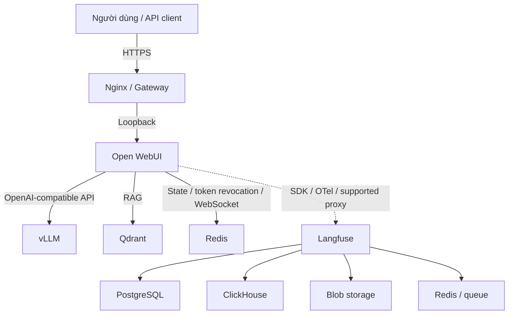

# LOCAL AI STACK TRÊN NVIDIA GB10

## Kiến trúc, triển khai, bảo mật và vận hành

> **Tài liệu chuẩn duy nhất (canonical runbook)**
>
> Cập nhật: **2026-09-03**
>
> Phạm vi: `/home/admin/ai-stack`
>
> Nền tảng đã xác minh: `aarch64`, Ubuntu 24.04.4 LTS, NVIDIA GB10, driver 580.173.02
>
> Trạng thái: **đang chạy thử nghiệm; chưa đạt production readiness**

Tài liệu này hợp nhất nội dung hữu ích từ tài liệu triển khai cũ và
`Software_Engineering_AI_Stack.md`. Cấu hình chạy thực tế nằm trong
`docker-compose.yml`; tài liệu này giải thích quyết định, quy trình và tiêu chí
nghiệm thu, không lặp lại toàn bộ Compose để tránh sai lệch theo thời gian.

## Mục lục

1. [Cách sử dụng và nguồn sự thật](#1-cach-su-dung-va-nguon-su-that)
2. [Đánh giá hiện trạng](#2-danh-gia-hien-trang)
3. [Kiến trúc hệ thống](#3-kien-truc-he-thong)
4. [Yêu cầu và SLO](#4-yeu-cau-va-slo)
5. [Nền tảng và cấu hình chuẩn](#5-nen-tang-va-cau-hinh-chuan)
6. [Triển khai và xác minh](#6-trien-khai-va-xac-minh)
7. [Bảo mật và quản trị dữ liệu](#7-bao-mat-va-quan-tri-du-lieu)
8. [Hiệu năng và capacity planning](#8-hieu-nang-va-capacity-planning)
9. [Quan sát, sao lưu và vận hành](#9-quan-sat-sao-luu-va-van-hanh)
10. [Kiểm thử khả năng phục hồi](#10-kiem-thu-kha-nang-phuc-hoi)
11. [Xử lý sự cố](#11-xu-ly-su-co)
12. [Checklist đưa vào production](#12-checklist-dua-vao-production)
13. [Tài liệu tham khảo và changelog](#13-tai-lieu-tham-khao-va-changelog)

---

<a id="1-cach-su-dung-va-nguon-su-that"></a>
## 1. Cách sử dụng và nguồn sự thật

Thứ tự ưu tiên khi thông tin mâu thuẫn:

1. Runtime đã kiểm tra: image digest, model root, log khởi động và kết quả test.
2. `docker-compose.yml`: dịch vụ, port, volume và tham số dự kiến.
3. `.env` hoặc secret manager: giá trị bí mật; không được commit.
4. Tài liệu này: kiến trúc, quy trình, SLO, tiêu chí chấp nhận và roadmap.
5. Tài liệu nhà cung cấp đúng với phiên bản đã pin.

Mỗi thay đổi về image, model, context length, quantization, port, storage hoặc auth
phải cập nhật bảng hiện trạng, chạy lại smoke test và benchmark liên quan. Không
gọi cấu hình là "production" nếu checklist mục 12 chưa có bằng chứng.

### Quy ước trạng thái

| Trạng thái | Ý nghĩa |
| --- | --- |
| `target` | Mục tiêu kỹ thuật, chưa phải kết quả đo |
| `configured` | Đã khai báo trong cấu hình, chưa chắc runtime hoạt động |
| `verified` | Đã kiểm tra bằng lệnh/test và lưu bằng chứng |
| `blocked` | Chưa đủ điều kiện đưa vào production |

---

<a id="2-danh-gia-hien-trang"></a>
## 2. Đánh giá hiện trạng

Kiểm tra ngày 2026-09-03 cho thấy sáu container đang chạy: vLLM, Open WebUI,
Qdrant, Redis, Langfuse v2 và PostgreSQL của Langfuse. Endpoint health của vLLM,
Open WebUI, Qdrant và Langfuse đều phản hồi. Đây chỉ là bằng chứng dịch vụ đang
hoạt động, không phải bằng chứng về bảo mật, RAG, tracing, tải hay phục hồi.

`docker compose config --quiet` pass, nhưng cảnh báo top-level
`version: '3.8'` đã obsolete.

### 2.1. Các trở ngại đối với production

| ID | Mức | Bằng chứng hiện tại | Việc cần làm | Điều kiện đóng |
| --- | --- | --- | --- | --- |
| SEC-01 | P0 | Secret đang được hard-code trong Compose | Thay tất cả secret, chuyển sang secret store hoặc `.env` với quyền `0600` | Không còn secret trong Git; secret cũ đã được rotate |
| SEC-02 | P0 | Open WebUI publish `3000:8080` trên IPv4 và IPv6 | Chỉ bind `127.0.0.1:3000:8080` sau Nginx/VPN | Quét port từ máy trong LAN không truy cập được backend |
| REL-01 | P0 | Image dùng `latest`, `main`; Langfuse v2.95.11 | Pin phiên bản/digest; lập kế hoạch migrate Langfuse theo hướng dẫn chính thức | Upgrade và rollback pass trên staging |
| AI-01 | P0 | Hai alias `qwen2.5-14b` và `qwen2.5-72b` cùng trỏ tới model 14B | Chỉ công bố tên model đúng với model root | `/v1/models` không còn alias sai |
| OBS-01 | P0 | Có Langfuse nhưng không có instrumentation/credential kết nối | Thêm SDK, OpenTelemetry hoặc proxy được hỗ trợ và test end-to-end | Một request test có trace, user/session và latency đúng |
| GOV-01 | P0 | RBAC phòng ban mới chỉ là tuyên bố trong tài liệu | Cấu hình group/knowledge ACL và test chéo tenant | Bộ test không rò rỉ tài liệu đạt 100% |
| DR-01 | P0 | Chưa có backup, restore test, RPO/RTO | Định nghĩa và thử phục hồi từng kho dữ liệu | Restore trên môi trường sạch đạt RPO/RTO |
| REL-02 | P1 | Phần lớn service không có healthcheck; `depends_on` chỉ đảm bảo thứ tự start | Thêm readiness/healthcheck và dependency `service_healthy` | Restart toàn stack từ cold state pass |
| OPS-01 | P1 | Chưa pin retention/log rotation/alert | Đặt rotation, dashboard và alert có owner | Test alert và dung lượng log pass |
| NET-01 | P1 | Nginx/TLS/rate limit được mô tả nhưng không có file trong repo | Version-control cấu hình gateway và quy trình certificate | `nginx -t`, TLS scan và load test pass |
| DATA-01 | P1 | Qdrant không có API key; Redis dùng một mật khẩu chung | Auth service-to-service, ACL và network nội bộ | Truy cập không có credential bị từ chối |
| HOST-01 | P1 | Redis cảnh báo `vm.overcommit_memory` chưa bật | Xác minh trên host, bật `vm.overcommit_memory=1` và lưu cấu hình sysctl sau kiểm thử | Cảnh báo biến mất sau reboot; persistence test pass |
| AI-02 | P1 | vLLM cảnh báo FP8 KV scale đang dùng giá trị mặc định `1.0`, chưa được hiệu chuẩn | Hiệu chuẩn scale theo recipe hoặc tắt FP8 KV cache; chạy A/B quality | Quality gate và load test pass với cấu hình đã pin |
| REL-03 | P1 | `--model` sắp deprecated, revision vẫn là `main` và truy cập Hugging Face gặp lỗi DNS | Cập nhật tham số theo phiên bản vLLM đã pin, pin model revision và ổn định đường tải model | Cold start lặp lại được, không phụ thuộc revision moving và không còn lỗi DNS |
| RAG-01 | P1 | Compose không đặt `RAG_EMBEDDING_MODEL`; tuyên bố dùng `BAAI/bge-m3` chưa có bằng chứng | Lưu bằng chứng về persisted config, model và dimension thực; backup rồi chạy reindex test | Model/dimension được ghi nhận và upload-reindex-retrieve pass |
| PERF-01 | P2 | Runtime cảnh báo `OMP_NUM_THREADS=8` có thể gây contention | Benchmark các mức thread với workload chuẩn và pin giá trị phù hợp | Giá trị thread đã pin; latency/throughput đạt SLO mà không có contention đáng kể |

### 2.2. Các nhận định cũ đã được sửa

- `--max-model-len` chỉ giới hạn context; nó không tự cắt lịch sử. Request vượt
  giới hạn có thể bị từ chối. Open WebUI/middleware phải budget prompt, RAG và
  output.
- `--max-num-seqs 64` là giới hạn scheduler, không bảo đảm 64 người dùng với
  context 16K và không bảo đảm "zero OOM".
- Prefix caching tái sử dụng KV của prefix token trùng khớp; nó không phải
  semantic response cache và không trả lại câu trả lời đã cache.
- `REDIS_URL` của Open WebUI phục vụ application state/session và phối hợp
  WebSocket. Repo không có Celery worker hay semantic cache.
- Việc cài Langfuse cùng Compose không tự động tạo trace. Phải có instrumentation và
  một bài test xác nhận.
- `ipc: host` chia sẻ IPC namespace; nó không tạo "zero-bus latency".
- FP8 và AWQ INT4 không có cùng kích thước. Không ước lượng RAM từ số parameter;
  dùng kích thước checkpoint và profile runtime thực.
- Redis dùng cho session/token revocation phải ưu tiên `noeviction`. Nếu cần
  response cache, tách instance và eviction policy riêng.
- Không dùng `docker system prune -f` như tác vụ định kỳ. Lệnh này có thể xóa
  artifact cần cho rollback và không mặc định xóa volume.
- "Fail open" không phù hợp với dependency tham gia auth/authorization. Các luồng
  nhạy cảm phải fail closed.

---

<a id="3-kien-truc-he-thong"></a>
## 3. Kiến trúc hệ thống

### 3.1. Kiến trúc mục tiêu



### 3.2. Ranh giới hiện tại

| Thành phần | Hiện tại | Mục tiêu |
| --- | --- | --- |
| Gateway | Chưa có cấu hình version-control trong repo | Nginx/Caddy có TLS, streaming, security headers và rate limit |
| Open WebUI | Một replica, SQLite volume, port 3000 public | Pin version, loopback, HTTPS, auth hardening; Postgres nếu cần scale |
| vLLM | Qwen2.5-14B, FP8 runtime/KV, context 16K, 64 seq | Model/profile theo NVIDIA DGX Spark recipe và benchmark nội bộ |
| Qdrant | Community integration, loopback, chưa có API key | Private network, API key/TLS khi qua network, snapshot và upgrade test |
| Redis | Open WebUI state, AOF, password chung | `noeviction`, ACL, memory alert; tách khỏi cache/queue khác |
| Langfuse | v2 + PostgreSQL, chưa nối trace | Migrate theo release được hỗ trợ; đầy đủ web/worker/data stores |
| Monitoring | Lệnh thủ công | Metrics, dashboard, alert và retention |

Không thêm Celery, LiteLLM, Prometheus, Grafana hoặc một model thứ hai vào sơ đồ
"hiện tại" cho đến khi service đó tồn tại trong cấu hình và có smoke test.

---

<a id="4-yeu-cau-va-slo"></a>
## 4. Yêu cầu và SLO

Mỗi SLO phải kèm profile workload, percentile và cửa sổ đo. Các giá trị dưới đây
là **target tạm thời** kế thừa từ tài liệu cũ, chưa phải kết quả benchmark.

### 4.1. Profile đo chuẩn

| Thuộc tính | Giá trị khởi đầu |
| --- | --- |
| Prompt | 2,048 input tokens |
| Output | 256 tokens |
| Streaming | Bật |
| Model | Dùng chính xác `root`, revision và quantization của runtime |
| Mẫu đo | Cold start, warm không cache, warm có prefix hit |
| Tải | Ramp 1, 4, 8, 16 request/s; sau đó thử 8, 16, 32, 64 client |
| Báo cáo | p50, p95, p99; success rate; queue time; throughput; peak memory |

### 4.2. SLO tạm thời

| Chỉ số | Target | Ghi chú |
| --- | --- | --- |
| Availability | 99.9%/tháng | Một node không thể chịu lỗi phần cứng; đây là service target, không phải HA guarantee |
| TTFT p95 | < 1.5 s | Chỉ đánh giá với profile và tải đã công bố |
| ITL p95 | < 50 ms/token | Tách khỏi TTFT và queue time |
| Request thành công | >= 99% | Loại request bị validation từ chối; OOM và 5xx tính là lỗi |
| Cross-tenant RAG leak | 0 case | Bộ dữ liệu adversarial bắt buộc |
| RPO/RTO | TBD bởi owner | Phải quyết định trước production |

Concurrency không phải một con số cấu hình cố định. Mức được phê duyệt là mức cao
nhất vẫn đồng thời đạt TTFT, ITL, error rate và headroom bộ nhớ.

### 4.3. Business rules

- Admin và user không đủ để bảo đảm cách ly dữ liệu. Mỗi knowledge base phải có
  owner, group được đọc/ghi, retention và kiểm thử truy cập bị từ chối.
- Prompt, RAG context và output phải có token budget riêng. Nếu vượt ngân sách,
  ứng dụng phải summarize/truncate có chủ đích và báo lỗi rõ ràng.
- Tool/agent phải dùng allowlist, least privilege, timeout, output validation và
  audit. Không đưa secret vào prompt.
- Tài liệu truy xuất là dữ liệu không tin cậy. Không coi "chặn prompt injection"
  là một bộ lọc tuyệt đối; cần phân tách instruction/data và kiểm soát tool.
- Rate limit tại gateway chỉ là lớp bảo vệ. Công bằng theo user/tenant cần được
  thực thi tại lớp đã xác thực.

---

<a id="5-nen-tang-va-cau-hinh-chuan"></a>
## 5. Nền tảng và cấu hình chuẩn

### 5.1. Phần cứng đã xác minh

| Hạng mục | Giá trị |
| --- | --- |
| Nền tảng | MSI GB10 dựa trên NVIDIA DGX Spark |
| CPU/GPU | Arm 20-core + NVIDIA GB10 Grace Blackwell |
| Bộ nhớ | 128 GB coherent unified memory |
| Kiến trúc OS | `aarch64` |
| OS trên máy | Ubuntu 24.04.4 LTS |
| GPU monitoring | `nvidia-smi` nhận GPU, nhưng `memory.total` trả `N/A` trên iGPU này |

DGX OS đã cài sẵn Docker và NVIDIA Container Toolkit. Chỉ cài lại theo hướng dẫn
của NVIDIA khi preflight thất bại; không chạy một chuỗi cài Docker chung chung trên
máy đang vận hành.

### 5.2. Preflight

```bash
uname -m
cat /etc/os-release
nvidia-smi
docker version
docker compose version
docker info
df -h
free -h
```

Kết quả tối thiểu: `aarch64`, GPU GB10 được nhận, Docker daemon hoạt động, còn
đủ dung lượng cho image/model/backup và không có lỗi runtime NVIDIA.

### 5.3. Profile vLLM

Không tồn tại một cấu hình "tối ưu tuyệt đối". Bắt đầu bảo thủ và tăng dần sau
benchmark:

| Tham số | Baseline để thử | Điều kiện thay đổi |
| --- | --- | --- |
| Model/image | Recipe DGX Spark đã được NVIDIA/vLLM test | Pin tag/digest và model revision |
| `gpu-memory-utilization` | 0.70 | Tăng từng bước nếu có headroom; unified memory dễ OOM khi đặt quá cao |
| `max-model-len` | 16,384 | Chỉ tăng khi workload cần và long-context test pass |
| `max-num-seqs` | 8 hoặc 16 | Tăng lên 32/64 nếu SLO và memory headroom pass |
| Weight quantization | Dùng format của checkpoint/recipe | Không ép `--quantization fp8` nếu model/image không hỗ trợ |
| `kv-cache-dtype fp8` | Tắt trong baseline chất lượng | Bật sau A/B quality và load test; calibrate scale nếu recipe yêu cầu |
| Prefix caching | Bật cho prefix dùng chung đã kiểm soát | Cách ly/salt theo trust group; đánh giá timing side-channel |
| Tool parser | Khớp model/chat template | Qwen2.5 có thể dùng Hermes với phiên bản vLLM hỗ trợ |
| Speculative decoding | Tắt | Chỉ bật nếu A/B cho thấy workload thực được cải thiện mà không giảm throughput |

Biến `VLLM_ATTENTION_BACKEND=FLASH_ATTN` trong runtime hiện tại bị vLLM 0.28.0
báo không nhận diện; engine đang tự chọn backend. Xóa biến hoặc thay theo tài liệu
của image đã pin sau khi xác minh log.

Mỗi model root chỉ nên có một served name phản ánh đúng model. Không đặt alias 72B cho
checkpoint 14B.

### 5.4. Yêu cầu tối thiểu cho Compose

- Bỏ top-level `version` obsolete.
- Pin image bằng version, tốt hơn là digest sau khi staging pass.
- Đọc secret qua secret store/`.env`; `.gitignore` không mã hóa secret và
  không xử lý secret từng commit.
- Chỉ expose gateway. Backend dùng Docker internal network hoặc loopback nếu host
  cần truy cập.
- Thêm healthcheck, `depends_on.condition: service_healthy`, log rotation,
  resource reservation/limit phù hợp và shutdown grace period.
- Tách network frontend/backend/data. Đặt `internal: true` cho data network nếu
  không cần egress.
- Ghi model revision, image digest và tham số runtime vào artifact của mỗi lần
  benchmark.

Danh sách secret tối thiểu cần quản lý gồm `WEBUI_SECRET_KEY`,
`REDIS_PASSWORD`, `QDRANT_API_KEY`, `POSTGRES_PASSWORD`,
`NEXTAUTH_SECRET`, `SALT`, `ENCRYPTION_KEY` và các key Langfuse. Tên biến
chỉ có tác dụng sau khi Compose đã được sửa để tham chiếu chúng.

### 5.5. Langfuse

Langfuse v2 đã hết cập nhật bảo mật. Không nâng cấp bằng cách chỉ đổi image tag.
Quy trình mục tiêu:

1. Backup và test restore PostgreSQL hiện tại.
2. Lập staging và theo đúng migration guide v2 -> v3.
3. Bổ sung worker, ClickHouse, Redis và blob storage theo official Compose.
4. Xác minh ingestion/read path, sau đó theo migration guide v3 -> v4 nếu chọn v4.
5. Pin release, test rollback, rồi mới chuyển production.

Nếu chưa migrate, giới hạn Langfuse v2 trên loopback/VPN và coi observability là
`blocked`, không phải security control.

---

<a id="6-trien-khai-va-xac-minh"></a>
## 6. Triển khai và xác minh

### 6.1. Trước khi thay đổi

1. Ghi lại `docker compose images`, image digest, model root/revision và
   `docker compose config` đã redact.
2. Backup các kho dữ liệu bị ảnh hưởng và xác minh đọc được backup.
3. Chạy thay đổi trên staging hoặc một Compose project/port riêng.
4. Định nghĩa lệnh rollback và ngưỡng abort trước khi bắt đầu.

### 6.2. Kiểm tra cấu hình

```bash
docker compose config --quiet
docker compose pull
docker compose up -d
docker compose ps
```

Không `pull` tag moving trong production nếu chưa ghi lại digest và chưa có
backup. `depends_on` chỉ bảo đảm thứ tự khởi động nếu không có healthcheck.

### 6.3. Smoke test

```bash
curl -fsS http://127.0.0.1:8000/health
curl -fsS http://127.0.0.1:8000/v1/models
curl -fsS http://127.0.0.1:3000/health
curl -fsS http://127.0.0.1:6333/healthz
docker compose ps
```

Sau health check, phải test thêm:

1. Một request chat streaming và một request chat non-streaming.
2. Context sát giới hạn và context vượt giới hạn có lỗi dự kiến.
3. Upload, index, retrieve và xóa một tài liệu RAG test.
4. User không có quyền không thể tìm thấy nội dung của group khác.
5. Một request có trace đầy đủ trong Langfuse.
6. Restart từng dependency và toàn stack.

### 6.4. Rollback

- Rollback image/model/config theo digest/revision đã ghi, không theo tag moving.
- Không hạ schema database nếu chưa có thủ tục được nhà cung cấp hỗ trợ.
- Nếu migration data không backward-compatible, restore vào project/volume mới
  và chuyển traffic sau khi smoke test.
- Ghi thời gian, lý do, metric và kết quả vào change record.

---

<a id="7-bao-mat-va-quan-tri-du-lieu"></a>
## 7. Bảo mật và quản trị dữ liệu

### 7.1. Port và trust boundary

| Port | Service | Chính sách |
| --- | --- | --- |
| 443 | Gateway | Mở cho LAN/VPN được phép; TLS bắt buộc |
| 80 | Gateway | Chỉ redirect sang HTTPS nếu cần |
| 22 | SSH | Chỉ admin subnet/VPN, key auth, không mở rộng toàn LAN |
| 3000 | Open WebUI | Loopback để Nginx proxy; không public trực tiếp |
| 8000 | vLLM | Internal/loopback; thêm API auth nếu có consumer khác |
| 6333/6334 | Qdrant | Internal; API key và TLS nếu đi qua network |
| 6379 | Redis | Internal; ACL/password; không public |
| 3001 | Langfuse | Loopback/VPN/admin gateway |
| 5432 và data ports | Databases | Internal only |

Nginx cần truyền `Host`, `X-Forwarded-*`, WebSocket upgrade; tắt proxy
buffering cho SSE; đặt timeout, upload limit, security headers và rate limit.
`WEBUI_URL` và CORS phải trùng domain HTTPS. Chứng chỉ self-signed chỉ phù hợp
với lab nếu CA/SAN chưa được quản lý trên client.

### 7.2. Authentication và authorization

- Tạo admin trong cửa sổ bootstrap, sau đó tắt public signup hoặc đặt user mới ở
  trạng thái pending.
- Bật password validation, secure cookie, token revocation và session timeout.
- Dùng SSO/OIDC nếu doanh nghiệp có IdP; hạn chế domain và mapping group.
- Kiểm thử authorization tại API và retrieval layer, không chỉ ẩn nút trên UI.
- Qdrant collection/payload phải mang tenant/group identity và query filter bắt
  buộc. Test deny-by-default.
- Prefix/cache dùng chung giữa các tenant phải được isolate hoặc salt theo trust group.

### 7.3. Secrets và dữ liệu

- Secret từng xuất hiện trong file tracked phải được rotate, kể cả khi repo private.
- `.env` đặt quyền `0600`, không backup chung với artifact công khai và không
  đưa vào log/support bundle.
- SED chỉ bảo vệ dữ liệu khi ở trên đĩa; phải xác minh nó đã được enable và quản lý recovery
  key. Nó không thay thế TLS hay application-level access control.
- Xác định retention cho chat, file gốc, vector, trace, log và backup; hỗ trợ xóa
  theo user/tenant.
- Không vận hành bằng đường dẫn
  `/var/lib/docker/volumes/<ten-co-dinh>`. Lấy tên/mountpoint thực bằng
  `docker volume ls` và `docker volume inspect <volume>`.

---

<a id="8-hieu-nang-va-capacity-planning"></a>
## 8. Hiệu năng và capacity planning

### 8.1. Nguyên tắc

- Bộ nhớ 128 GB là unified memory của cả CPU và GPU, không phải 128 GB riêng cho
  weights/KV cache. Phải chừa headroom cho OS, Open WebUI, database và spike.
- Long context, concurrency và KV cache nhân với nhau. Tăng một tham số có thể làm
  giảm giới hạn của tham số khác.
- Continuous batching tăng throughput trong nhiều workload nhưng không có hệ số
  cải thiện cố định.
- FP8 KV cache và speculative decoding là tối ưu có trade-off; đánh giá chất
  lượng và throughput, không chỉ tokens/s.
- Prefix hit chỉ so sánh với warm no-cache và phải báo cáo hit rate.

### 8.2. Benchmark có thể lặp lại

Dùng CLI của chính phiên bản vLLM đã pin:

```bash
vllm bench serve \
  --backend openai-chat \
  --base-url http://127.0.0.1:8000 \
  --endpoint /v1/chat/completions \
  --model <served-model-name> \
  --dataset-name random \
  --random-input-len 2048 \
  --random-output-len 256 \
  --request-rate 4 \
  --num-prompts 200 \
  --save-result \
  --save-detailed \
  --result-dir benchmark-results
```

Chạy lại với request rate 1/4/8/16, context ngắn/dài và các cấp
`max-num-seqs`. Mỗi kết quả phải kèm:

- OS, driver, vLLM image digest và model revision.
- Tất cả engine arguments và biến môi trường có ảnh hưởng.
- Dataset/seed, input/output token distribution và warm-up.
- TTFT/ITL/E2E/queue p50-p95-p99, request throughput, token throughput, error.
- Peak system memory, GPU utilization, nhiệt độ, power, preemption và OOM.
- Kết quả quality/eval khi thay quantization, KV dtype, parser hoặc speculative
  decoding.

Chọn profile có goodput cao nhất trong SLO, không chọn profile có throughput tổng
cao nhất nếu tail latency hoặc error rate vượt ngưỡng.

---

<a id="9-quan-sat-sao-luu-va-van-hanh"></a>
## 9. Quan sát, sao lưu và vận hành

### 9.1. Tín hiệu tối thiểu

| Lớp | Metric/log cần có |
| --- | --- |
| Gateway | RPS, active connections, 4xx/5xx, upstream latency, TLS expiry |
| vLLM | TTFT, ITL, E2E, queue time, running/waiting requests, tokens/s, preemption |
| Host | CPU, `free`/PSI memory, disk/inode, temperature, power, network |
| Open WebUI | Login failure, 5xx, websocket error, upload/index latency |
| Qdrant | Query latency/error, collection size, snapshot age |
| Redis | Memory, rejected connection, persistence error, eviction (target 0) |
| Langfuse/data stores | Ingestion lag/error, worker queue, DB health, storage growth |
| Backup | Last successful backup, restore-test age, RPO breach |

vLLM có Prometheus `/metrics`; Langfuse phục vụ trace/eval sau khi instrumentation
hoạt động. `nvidia-smi` và `htop` là công cụ chẩn đoán, không thay thế monitoring
và alert liên tục. Trên GB10 hiện tại, `nvidia-smi` không báo total GPU memory,
vì vậy cần kết hợp DGX Dashboard, system/cgroup metrics và metric của engine.

Lệnh kiểm tra nhanh:

```bash
docker compose ps
docker compose logs --tail 200 vllm
docker compose logs --tail 200 open-webui
docker compose logs --tail 200 qdrant
docker compose logs --tail 200 redis
docker compose logs --tail 200 langfuse-web
curl -fsS http://127.0.0.1:8000/metrics
```

### 9.2. Backup và restore

| Dữ liệu | Phương pháp |
| --- | --- |
| Open WebUI | Backup database + uploads theo tài liệu phiên bản; đảm bảo snapshot nhất quán |
| Qdrant | Dùng Qdrant snapshot API; không chỉ copy file khi đang ghi |
| PostgreSQL | `pg_dump`/base backup phù hợp; kiểm tra restore |
| Langfuse mới | Backup PostgreSQL, ClickHouse và blob storage theo cùng recovery point |
| Redis | AOF/RDB nếu state cần phục hồi; không xem Redis là bản backup chính |
| Model/config | Lưu manifest model revision, image digest và config; weights có thể tải lại nếu nguồn còn tồn tại |

Backup chưa được coi là thành công cho đến khi restore trên môi trường sạch và
smoke test pass. Mã hóa backup, tách quyền truy cập và giữ ít nhất một bản ngoài
host.

### 9.3. Bảo trì và upgrade

1. Đọc release notes/security advisory của từng thành phần.
2. Backup và test staging với version/digest cũ và mới.
3. Chạy smoke, RAG ACL, benchmark ngắn và restore test liên quan.
4. Canary/chuyển traffic trong maintenance window.
5. Theo dõi SLO và rollback nếu vượt ngưỡng abort.
6. Cập nhật bảng hiện trạng, bằng chứng và changelog.

Không auto-update image moving tag trong production.

---

<a id="10-kiem-thu-kha-nang-phuc-hoi"></a>
## 10. Kiểm thử khả năng phục hồi

| Case | Cách thử | Kết quả mong đợi |
| --- | --- | --- |
| Quá tải | Ramp đến trên capacity đã phê duyệt | Backpressure/429 có giới hạn; không OOM; hệ thống hồi phục |
| Prompt vượt context | Gửi prompt + RAG + output vượt budget | 4xx/response rõ ràng; không 500; không cắt im lặng |
| Client ngắt stream | Đóng kết nối khi đang generate | Work được hủy trong timeout đã đặt và slot được giải phóng |
| RAG rỗng/file lỗi | Upload file rỗng, hỏng và không hỗ trợ | Lỗi hữu ích; không index rác; có audit |
| Qdrant/Redis mất | Stop từng dependency | Luồng nhạy cảm fail closed; health/alert kích hoạt |
| Langfuse mất | Stop telemetry stack | Inference theo policy đã định; không mất kiểm soát auth; có alert |
| Restart host | Reboot trong maintenance test | Service khởi động đúng thứ tự và data còn nguyên |
| Disk sắp đầy | Mô phỏng threshold an toàn | Alert sớm; ingestion bị giới hạn có kiểm soát |
| Backup hỏng | Thử restore bản gần nhất | Phát hiện trước production; fallback theo retention |

Lưu ngày test, version, người thực hiện và link log/result. Không đánh dấu pass
chỉ dựa trên mô tả của nhà cung cấp.

---

<a id="11-xu-ly-su-co"></a>
## 11. Xử lý sự cố

### vLLM OOM hoặc bị kill

1. Kiểm tra `docker compose logs --tail 300 vllm`, `free -h`, PSI memory và
   kernel OOM log.
2. Giảm `gpu-memory-utilization`, `max-num-seqs` và/hoặc
   `max-model-len`; chỉ thay đổi một biến mỗi lần.
3. Tắt speculative decoding/FP8 KV cache để quay về baseline đã biết.
4. Chạy lại smoke + benchmark; không kết luận từ việc container chỉ "Up".

### Alias/model sai

So sánh `id` và `root` trong `/v1/models`. Nếu khác quy mô/model được công
bố, sửa `--served-model-name`, restart và xóa alias sai khỏi client.

### Open WebUI không kết nối vLLM

Kiểm tra service DNS `vllm`, endpoint `http://vllm:8000/v1`, model name và log
hai container. Từ host dùng loopback; từ container dùng service name, không dùng
`localhost`.

### RAG sai hoặc mất dữ liệu

Xác minh embedding model/dimension không đổi, Qdrant collection/filter đúng
tenant và file gốc còn tồn tại. Backup snapshot trước khi reindex. Qdrant chỉ lưu
vector/index; không mặc định là nơi duy nhất chứa file gốc.

### Không có trace Langfuse

Health của Langfuse không đủ. Kiểm tra instrumentation, endpoint, public/secret
key, worker/queue/data store và trace ID từ request test.

### WebSocket/streaming chậm

Kiểm tra Nginx `proxy_buffering off`, HTTP/1.1 upgrade headers, CORS,
`WEBUI_URL`, timeout và proxy compression. Đo riêng gateway latency và vLLM
TTFT.

---

<a id="12-checklist-dua-vao-production"></a>
## 12. Checklist đưa vào production

### P0 - Bắt buộc

- [ ] Rotate mọi secret đang có trong `docker-compose.yml`; scan Git history.
- [ ] Chuyển secret ra khỏi Compose và đặt access/rotation procedure.
- [ ] Đóng port 3000 trên LAN/IPv6; chỉ công bố HTTPS gateway.
- [ ] Pin tất cả image/model revision; loại alias `qwen2.5-72b` sai.
- [ ] Quyết định và thực hiện migration Langfuse khỏi v2.
- [ ] Kết nối tracing end-to-end hoặc bỏ Langfuse khỏi kiến trúc được tuyên bố.
- [ ] Cấu hình và test RBAC/RAG isolation theo group/tenant.
- [ ] Định nghĩa RPO/RTO; backup và restore test pass.
- [ ] Chạy benchmark có thể lặp lại; phê duyệt capacity và SLO thực đo.

### P1 - Reliability và operations

- [ ] Thêm healthcheck/readiness, startup ordering và graceful shutdown.
- [ ] Version-control Nginx/TLS/rate-limit config; test `nginx -t`.
- [ ] Đặt Redis `noeviction`, memory alert và ACL; tách workload nếu cần.
- [ ] Bật Qdrant authentication và snapshot policy.
- [ ] Thêm log rotation, metrics, dashboard, alerts và owner.
- [ ] Test overload, dependency failure, client disconnect, restart và disk pressure.
- [ ] Tài liệu hóa upgrade, rollback, data retention và incident procedure.

### Production gate

Chỉ chuyển trạng thái tài liệu từ `đang chạy thử nghiệm` sang `production` khi:

1. Tất cả P0 hoàn tất và có bằng chứng.
2. Không còn backend public ngoài gateway.
3. SLO đạt trong soak test dài hơn peak business window.
4. Restore và rollback đã thực hiện thành công.
5. Owner vận hành, security và data đã phê duyệt.

---

<a id="13-tai-lieu-tham-khao-va-changelog"></a>
## 13. Tài liệu tham khảo và changelog

Tài liệu chính thức, kiểm tra ngày 2026-09-03:

- [MSI EdgeExpert GB10 datasheet](https://download-2.msi.com/archive/mnu_exe/ipc/EdgeXpert_DM_dm.pdf)
- [NVIDIA DGX Spark User Guide](https://docs.nvidia.com/dgx/dgx-spark/)
- [NVIDIA: Serve LLMs with vLLM on DGX Spark](https://build.nvidia.com/spark/vllm)
- [NVIDIA vLLM release notes](https://docs.nvidia.com/deeplearning/frameworks/vllm-release-notes/)
- [vLLM Docker deployment](https://docs.vllm.ai/en/stable/deployment/docker/)
- [vLLM engine arguments](https://docs.vllm.ai/en/latest/configuration/engine_args/)
- [vLLM security và cache salting](https://docs.vllm.ai/en/latest/usage/security/)
- [vLLM tool calling](https://docs.vllm.ai/en/latest/features/tool_calling/)
- [vLLM benchmark CLI](https://docs.vllm.ai/en/latest/cli/bench/serve/)
- [Open WebUI environment variables](https://docs.openwebui.com/reference/env-configuration/)
- [Open WebUI hardening](https://docs.openwebui.com/getting-started/advanced-topics/hardening/)
- [Open WebUI scaling](https://docs.openwebui.com/getting-started/advanced-topics/scaling/)
- [Open WebUI HTTPS/reverse proxy](https://docs.openwebui.com/reference/https/)
- [Open WebUI Redis/WebSocket](https://docs.openwebui.com/tutorials/integrations/redis/)
- [Langfuse self-hosting](https://langfuse.com/self-hosting)
- [Langfuse migration v2 -> v3](https://langfuse.com/self-hosting/upgrade/upgrade-guides/upgrade-v2-to-v3)
- [Langfuse migration v3 -> v4](https://langfuse.com/self-hosting/upgrade/upgrade-guides/upgrade-v3-to-v4)
- [Qdrant security](https://qdrant.tech/documentation/security/)
- [Redis security](https://redis.io/docs/latest/operate/oss_and_stack/management/security/)
- [Docker Compose startup order](https://docs.docker.com/compose/how-tos/startup-order/)
- [Docker Compose `version` field](https://docs.docker.com/reference/compose-file/version-and-name/)

### Changelog

| Ngày | Thay đổi |
| --- | --- |
| 2026-09-03 | Hợp nhất hai tài liệu; đổi từ mô tả marketing sang runbook có bằng chứng |
| 2026-09-03 | Đồng bộ hiện trạng 14B/16K/64, Ubuntu 24.04.4 và các container đang chạy |
| 2026-09-03 | Bỏ Celery/semantic-cache/fail-open khỏi kiến trúc hiện tại |
| 2026-09-03 | Thêm production blockers, SLO, RBAC, benchmark, backup/restore và production gate |

Việc hợp nhất tài liệu không tự động sửa `docker-compose.yml`. Các mục chưa
hoàn thành trong checklist là backlog cần triển khai và kiểm thử riêng.
